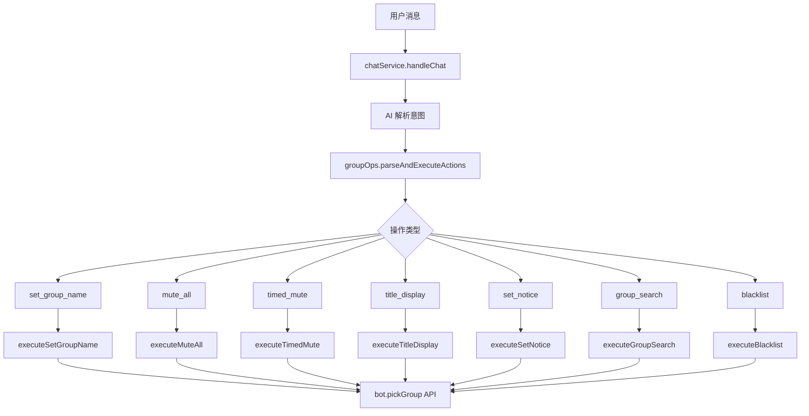

# 群管理功能扩展

Feature Name: group-management-features
Updated: 2026-08-21

## 描述

扩展 ai0-plugin 的群管理能力，新增 7 项群操作功能，覆盖群设置、成员管理、黑名单等场景。所有新功能遵循现有 groupOps 架构，通过 AI 解析用户意图并执行对应操作。每个操作同时作为工具/函数暴露，机器人可直接调用，需满足所有权限和条件。

## 架构



## 组件和接口

### 1. 操作类型定义

新增操作类型常量：
- `set_group_name` - 更改群名
- `mute_all` - 全体禁言
- `timed_mute` - 定时禁言
- `title_display` - 头衔展示管理
- `set_notice` - 更改群公告
- `group_search` - 群搜索方式管理
- `blacklist` - 群黑名单管理

### 2. 权限验证

所有新操作复用现有的 `verifyGroupOpPermission` 函数，添加对应操作类型的权限规则：

| 操作 | 请求者权限 | 机器人权限 |
|------|-----------|-----------|
| set_group_name | owner/admin/master | owner/admin |
| mute_all | owner/admin/master | owner/admin |
| timed_mute | owner/admin/master | owner/admin |
| title_display | owner | owner |
| set_notice | owner/admin/master | owner/admin |
| group_search | owner | owner |
| blacklist | owner/admin/master | owner/admin |

### 3. 底层执行函数

新增 7 个执行函数，每个函数封装对 bot.pickGroup API 的调用：

```javascript
// 更改群名
async function executeSetGroupName(groupId, name)

// 全体禁言
async function executeMuteAll(groupId, enable)

// 定时禁言
async function executeTimedMute(groupId, userId, seconds)

// 头衔展示管理
async function executeTitleDisplay(groupId, enable)

// 更改群公告
async function executeSetNotice(groupId, content)

// 群搜索方式管理
async function executeGroupSearch(groupId, enable)

// 黑名单管理
async function executeBlacklist(groupId, userId, action)
```

### 4. 工具/函数化设计

每个操作同时作为工具暴露，机器人可直接调用。工具调用需满足以下条件：

1. **权限验证**: 调用前必须经过 `verifyGroupOpPermission` 验证
2. **功能开关**: 必须检查对应功能的 `allowXxx` 开关
3. **参数校验**: 必须校验所有必要参数
4. **错误处理**: 必须捕获并返回明确的错误信息

工具调用流程：
```javascript
// 工具调用示例
async function toolSetGroupName(groupId, name, e) {
  // 1. 权限验证
  const perm = await verifyGroupOpPermission('set_group_name', groupId, null, e)
  if (!perm.ok) return { ok: false, msg: perm.reason }

  // 2. 功能开关检查
  if (cfg.get('groupOps.allowGroupName', true) === false) {
    return { ok: false, msg: '群名修改功能未启用' }
  }

  // 3. 参数校验
  if (!name || name.length > 30) {
    return { ok: false, msg: '群名不能为空且不能超过30个字符' }
  }

  // 4. 执行操作
  try {
    await executeSetGroupName(groupId, name)
    return { ok: true, msg: `已将群名更改为：${name}` }
  } catch (err) {
    return { ok: false, msg: `执行失败：${err.message}` }
  }
}
```

### 5. AI 提示词扩展

在 `buildGroupContext` 函数中添加新操作的说明和格式：

```
  - 改群名：[action:set_group_name:新群名]
  - 全体禁言开：[action:mute_all:1]
  - 全体禁言关：[action:mute_all:0]
  - 定时禁言：[action:timed_mute:目标QQ:时长秒数]
  - 头衔展示开：[action:title_display:1]
  - 头衔展示关：[action:title_display:0]
  - 改公告：[action:set_notice:公告内容]
  - 群搜索开：[action:group_search:1]
  - 群搜索关：[action:group_search:0]
  - 拉黑：[action:blacklist:add:目标QQ]
  - 解除拉黑：[action:blacklist:remove:目标QQ]
```

### 6. 功能开关配置

在 `config/config.yaml` 中添加以下配置项：

```yaml
groupOps:
  allowGroupName: true      # 群名修改
  allowMuteAll: true         # 全体禁言
  allowMuteTimed: true       # 定时禁言
  allowTitleDisplay: true    # 头衔展示
  allowNotice: true          # 群公告
  allowSearch: true          # 群搜索
  allowBlacklist: true       # 黑名单
```

## 数据模型

无新增数据模型。所有操作通过 bot.pickGroup API 直接执行，不需要本地持久化。

## 正确性属性

1. 所有操作必须经过权限验证，防止越权执行
2. 机器人权限不足时，必须拒绝操作
3. 目标是群主/管理员时，必须拒绝操作
4. 所有操作必须有功能开关控制
5. 操作失败时，必须返回明确的错误信息
6. 工具调用必须满足所有权限和条件

## 错误处理

| 错误场景 | 处理方式 |
|---------|---------|
| 请求者权限不足 | 返回"发送者无权限" |
| 机器人权限不足 | 返回"机器人不是群主/管理员" |
| 目标受保护 | 返回"目标受保护，不可操作" |
| 适配器不支持 | 返回"当前适配器不支持该操作" |
| API 调用失败 | 返回具体错误信息 |
| 功能未启用 | 返回"xxx功能未启用" |

## 测试策略

1. 单元测试：验证权限验证逻辑
2. 集成测试：验证与 bot.pickGroup API 的交互
3. 端到端测试：验证完整的消息处理流程

## 参考

1. `src/groupOps.js` - 现有群操作实现
2. `config/index.js` - 配置管理
3. `src/helper.js` - 辅助函数
