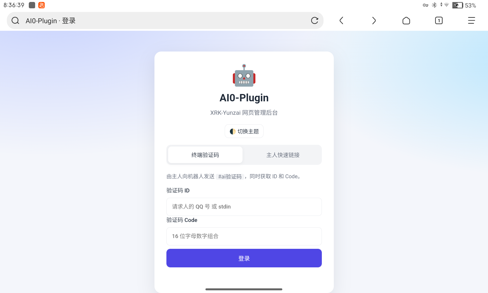
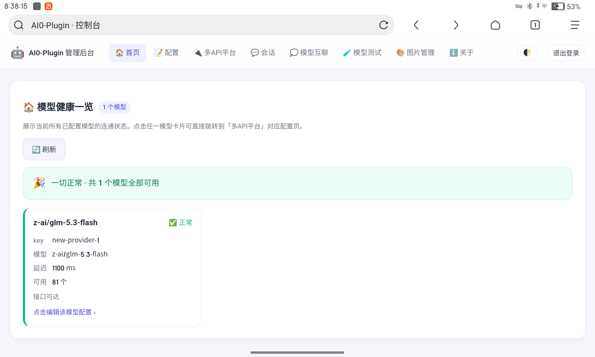

# AI0-Plugin

> 为 **XRK-Yunzai** 打造的轻量级 AI 聊天插件,集成**可视化网页管理后台**。
> 基于 OpenAI 兼容协议,可无缝接入 ChatGPT、DeepSeek、Kimi、通义千问、本地 Ollama 等任意大模型。


[🌎 Gitee](https://gitee.com/nidie2580/ai0-plugin) · [🌍 GitHub](https://github.com/nidie2580/ai0-plugin) · [🌐 GitCode](https://gitcode.com/ndnb/ai0-plugin)

---

## 📌 项目简介

给 QQ 群/私聊接入一个**带网页管理后台**的 AI 机器人,是件很常见但有点折腾的事:老插件配置全靠改文件、接 API 老报错、会话上下文管理混乱。

**AI0-Plugin 的目标就是把它变简单:**

- ✅ 一条命令装好,`config.yaml` 一处配置全部搞定
- ✅ 网页后台可视化改配置,不用再盯着 YAML 改半天
- ✅ 按「用户 + 群/私聊」隔离记忆,私聊不会串到群里
- ✅ 兼容一切 OpenAI 接口,今天用 DeepSeek,明天换本地 Ollama

---

## ✨ 核心功能

### 🤖 智能对话
*   **多端响应**:支持群聊 @机器人 与私聊直接提问。
*   **记忆上下文**:按「用户 + 群/私聊」隔离维护多轮对话历史,私聊内容不会带进群聊。
*   **防刷屏机制**:超长回复自动合并转发,保持聊天环境整洁。
*   **自定义触发**:可设置关键词前缀(如 `#ai `),无需 @ 即可唤醒。

### 🔌 多模型兼容
任何兼容 `/v1/chat/completions` 接口的服务均可接入,包括但不限于:
*   **官方服务**:OpenAI、DeepSeek、Kimi (Moonshot)、智谱 (GLM)、通义千问。
*   **聚合平台**:硅基流动 (SiliconFlow)。
*   **本地部署**:Ollama、LM Studio。

### 🛡️ 权限与管理
*   **精细化权限**:支持主人、管理员、白名单/黑名单模式。
*   **专属主人权限**:可执行所有管理命令并访问网页后台。

### 🌐 网页管理后台 (v1.1.0)
*   **可视化配置**:在线编辑模型、对话、权限等全部设置。
*   **会话管理**:浏览、检索或删除历史会话记录。
*   **连接测试**:一键验证模型 API 连通性。
*   **双重登录**:支持"主人命令直链"与"终端验证码"两种安全登录方式。

---

## 📸 界面预览

> 仅供参考哦

 · 

---

## 🚀 快速上手(5 分钟)

```bash
# 1. 进入 Yunzai 插件目录
cd Yunzai/plugins

# 2. 克隆插件(国内推荐 Gitee)
git clone https://gitee.com/nidie2580/ai0-plugin.git

# 3. 安装依赖
cd ai0-plugin
npm install

# 4. 填写配置(编辑 config/config.yaml)
#    - 把 permissions.masters 换成你的 QQ 号
#    - 填入你的模型 apiKey/model 等(建议用环境变量,见下文)

# 5. 重启 Yunzai 机器人
```

重启完成即可在群里 @机器人 测试。网页后台默认地址:`http://127.0.0.1:12580`。

> ⚙️ 依赖安装太慢?可使用国内镜像:`npm config set registry https://registry.npmmirror.com`

---

## 📦 安装与启动

> 依赖要求:Node.js ≥ 16,适用于 **XRK-Yunzai**(及大部分 Yunzai V3 衍生版本)。

在 Yunzai 项目目录下执行(**三选一**):

```bash
# 国内(推荐,速度快)
git clone https://gitee.com/nidie2580/ai0-plugin.git

# 国际(GitHub)
git clone https://github.com/nidie2580/ai0-plugin.git

# 备用(GitCode)
git clone https://gitcode.com/ndnb/ai0-plugin.git
```

```bash
cd ai0-plugin
npm install
```

重启 Yunzai 机器人,插件将自动加载并尝试启动网页后台服务。

---

## 🌐 网页后台登录指南

> **访问地址**:`http://127.0.0.1:12580` (默认)
> **局域网访问**:如需从其他设备访问,请修改 `config.yaml` 中 `web.host` 为 `0.0.0.0` 并开放防火墙端口。

### 方式一:主人命令直链 (推荐)
1.  以**主人 QQ** 向机器人发送命令:`#ai网页管理`。
2.  机器人将回复一条 **10分钟内有效、单次使用** 的免密链接。
3.  点击链接即可直接登录后台。
> **提示**:建议在私聊中使用此命令。群聊中会检测好友关系并把直链发到私信,不会把免登录链接贴进群。

### 方式二:终端验证码登录
1.  通过以下任一方式获取验证码:
    *   **在机器人运行时**:向机器人发送 `#ai验证码`。
    *   **独立获取**:在插件目录下执行 `npm run web`。
2.  从终端输出或机器人回复中获取 **ID** 与 **Code**。
3.  在后台登录页选择"终端验证码"标签页,输入获取的 ID 和 Code 即可登录。

---

## ⚙️ 配置说明

配置文件位于 `plugins/ai0-plugin/config/config.yaml`。

### 🔐 安全警示 (必读)
1.  **保护密钥**:示例中的 `apiKey` 为占位符。**切勿**将包含真实密钥的 `config.yaml` 提交至公开仓库 (该文件已默认被 `.gitignore` 忽略)。
2.  **使用环境变量 (更安全)**:推荐通过环境变量注入密钥,实现"密钥不落盘":
    *   `AI0_LLM_API_KEY`:(必填) 默认模型的 API Key。
    *   `AI0_LLM_API_BASE`:(可选) 覆盖配置文件中的 API Base 地址。
    *   `AI0_IMAGE_API_KEY`:(可选) 图片生成模型的 API Key。
    *   **示例**:`AI0_LLM_API_KEY=sk-xxxxx AI0_LLM_API_BASE=https://api.deepseek.com/v1 npm run web`
3.  设置环境变量后,可清空 `config.yaml` 中对应的 `apiKey` 字段。

### 核心配置项概览
```yaml
# ========== 模型配置 ==========
model:
  default: openai-compatible
  openai-compatible:
    name: "AI0模型"
    apiBase: "https://api.openai.com/v1"   # 替换为你的 API 地址
    apiKey: "YOUR_API_KEY_HERE"            # 建议使用环境变量
    model: "gpt-3.5-turbo"                 # 替换为具体模型名
    temperature: 0.8
    maxTokens: 2000

# ========== 对话设置 ==========
chat:
  groupAtReply: true        # 是否响应群聊 @
  privateReply: true        # 是否响应私聊
  triggerPrefix: []         # 自定义触发前缀,如 ["#ai ", "小爱"]
  contextSize: 10           # 记忆的上下文对话轮数
  privateRateLimit:
    enabled: true           # 私聊速率限制(防刷 API)
    windowMs: 60000
    maxReplies: 20

# ========== 权限设置 ==========
permissions:
  masters: [123456789]      # 填入你的 QQ 号 (主人)

# ========== 网页后台 ==========
web:
  autoStart: true           # 是否随 Yunzai 自动启动
  port: 12580               # 服务端口
  host: "127.0.0.1"         # 监听地址,改为 0.0.0.0 可允许局域网访问

# ========== 系统提示词 (支持动态变量) ==========
system:
  prompt: |
    你是一个友善的AI宝宝,QQ号是 <bot>。
    我的主人有:<master>;管理员有:<admin>。
    当前正与我说话的用户:<user>。
```

### 系统提示词动态变量
提示词中可使用以下变量,发送给模型前会被自动替换为实际值:

| 变量 | 说明 |
| :--- | :--- |
| `<master>` | 主人 QQ 号列表 (用顿号分隔) |
| `<user>` | 当前发送消息的用户 QQ |
| `<bot>` | 机器人自身的 QQ |
| `<admin>` | 管理员列表 (框架管理员 + 主人) |

### 🚀 主流模型接入示例
| 服务商 | `apiBase` | `model` 示例 |
| :--- | :--- | :--- |
| **OpenAI** | `https://api.openai.com/v1` | `gpt-3.5-turbo`, `gpt-4o` |
| **DeepSeek** | `https://api.deepseek.com/v1` | `deepseek-chat` |
| **硅基流动** | `https://api.siliconflow.cn/v1` | `Qwen/Qwen2.5-7B-Instruct` |
| **Kimi (Moonshot)** | `https://api.moonshot.cn/v1` | `moonshot-v1-8k` |
| **智谱 (GLM)** | `https://open.bigmodel.cn/api/paas/v4` | `glm-4-flash` |
| **通义千问** | `https://dashscope.aliyuncs.com/compatible-mode/v1` | `qwen-plus` |
| **本地 Ollama** | `http://127.0.0.1:11434/v1` | `qwen2.5:7b` |

---

## 🎮 全部命令列表

| 命令 | 功能 | 所需权限 |
| :--- | :--- | :--- |
| `#ai帮助` | 查看帮助菜单 | 所有用户 |
| `#ai新会话` | 重置当前对话的上下文 | 所有用户 |
| `#ai模型` | 查看当前使用的模型配置 | 所有用户 |
| `#ai设置模型 <模型名>` | 切换默认模型 | 主人 |
| `#ai设置apikey <key>` | 更新 API Key | 主人 |
| `#ai设置api <URL>` | 更新 API Base 地址 | 主人 |
| `#ai添加主人 <QQ>` | 新增主人账号 | 主人 |
| `#ai重载` | 重新加载配置文件 | 主人 |
| `#ai网页管理` / `#aiweb` | 启动后台并生成免密直链 | 主人 |
| `#ai网页启动` | 仅启动网页后台服务 | 主人 |
| `#ai网页关闭` | 关闭网页后台服务 | 主人 |
| `#ai验证码` | 生成终端登录验证码 | 主人 |

---

## ❓ 常见问题 (FAQ)

**Q:安装或 `npm install` 失败/卡住怎么办?**
A:先确认 Node.js ≥ 16;网络慢可切换国内镜像 `npm config set registry https://registry.npmmirror.com`;若仍失败,删除 `node_modules` 后重试。

**Q:网页后台打不开?**
A:依次检查:① 后台端口 12580 是否被占用(改 `web.port`);② 是否在 Yunzai 环境内运行/已重启;③ 局域网访问需把 `web.host` 改为 `0.0.0.0` 并放行防火墙端口。

**Q:群聊里机器人不回复?**
A:检查:① `permissions.masters` 是否已填你的 QQ;② `chat.groupAtReply` 是否为 `true`;③ 是否用了 @;若配置了 `triggerPrefix` 则无需 @,直接说前缀即可。

**Q:接入本地 Ollama 失败怎么办?**
A:确认 Ollama 已开启 OpenAI 兼容接口(新版默认支持 `/v1/chat/completions`),并确保 `apiBase` 填写 `http://127.0.0.1:11434/v1`;跨设备访问请确认机器间网络与防火墙。

**Q:会话记录存在哪里?怎么清理?**
A:会话历史以 JSON 形式保存在 `data/history/` 目录,删除该目录下文件即可清空历史,或在网页后台"会话管理"中删除。

**Q:如何切换模型?**
A:主人可用命令 `#ai设置模型 <模型名>` 切换,或在网页后台"可视化配置"中修改。

---

## 📁 项目目录结构

```
ai0-plugin/
├── index.js                     # 插件入口
├── package.json
├── apps/                        # 机器人消息处理
│   ├── chat.js                  # 对话监听
│   ├── commands.js              # 命令处理
│   └── groupOps.js              # 群操作命令
├── config/                      # 配置管理
│   ├── index.js
│   ├── default_config.yaml
│   └── config.yaml              # 用户配置文件
├── src/                         # 核心功能模块
│   ├── auth.js                  # 认证与会话
│   ├── webServer.js             # Express 服务器
│   ├── standalone-web.js        # 独立启动入口
│   ├── chatService.js
│   ├── helper.js
│   └── llm.js                   # LLM 调用与会话管理
├── web/                         # 网页前端
│   ├── login.html
│   ├── dashboard.html
│   └── assets/
└── data/history/                # 会话历史 JSON 存储
```

---

## 🤝 贡献

欢迎提交 Issue 反馈 Bug、建议新功能,或直接提交 Pull Request。

- 提交 Issue:[Gitee Issues](https://gitee.com/nidie2580/ai0-plugin/issues) / [GitHub Issues](https://github.com/nidie2580/ai0-plugin/issues)

---

## 📄 开源协议

本项目采用 [MIT License](https://opensource.org/licenses/MIT) 开源协议。
